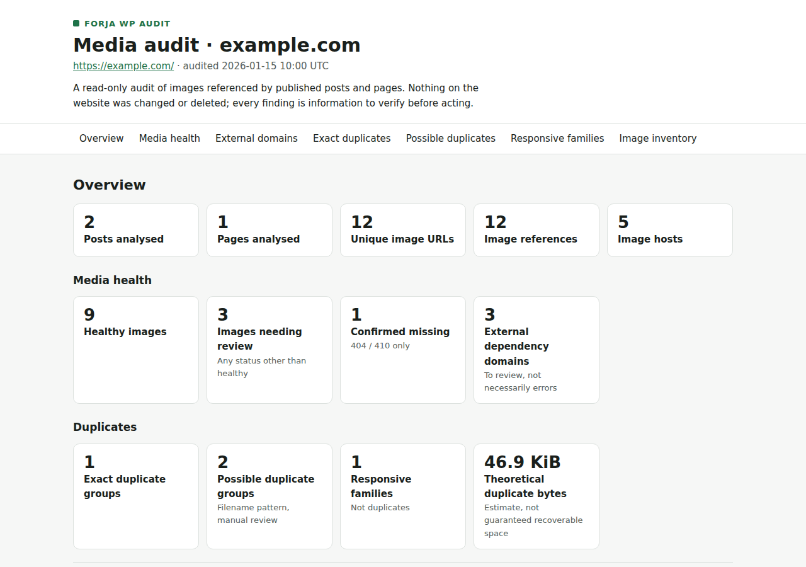
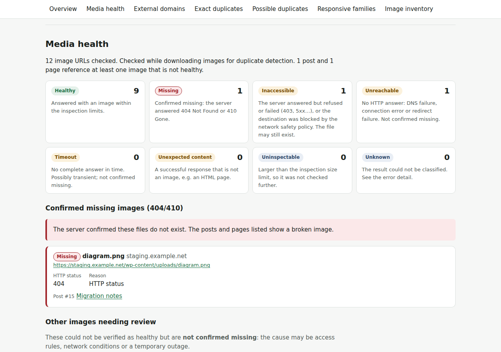
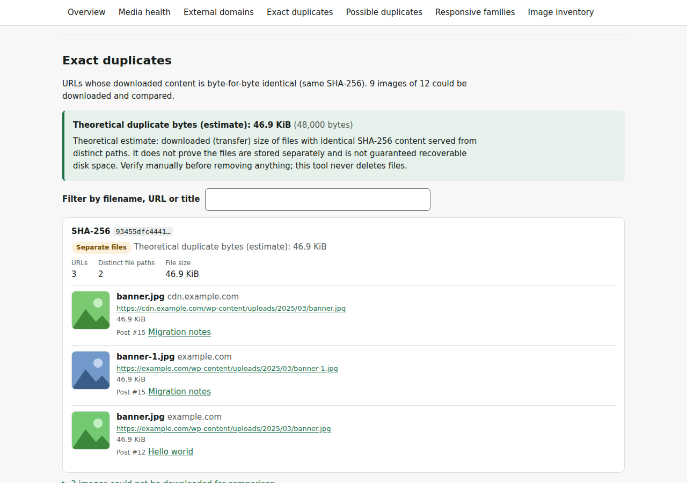
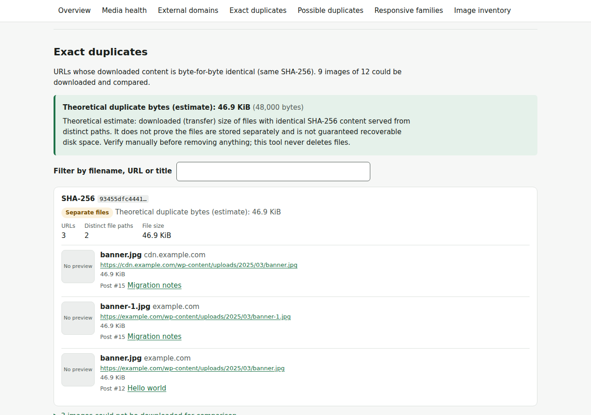

# Forja WP Audit

**Find duplicate images, broken media and external domain dependencies in your WordPress website.**

An open-source WordPress media auditing toolkit built with TypeScript. Analyze your media library, identify unnecessary duplicates and discover potential problems before migrating your website.

**Built for developers, agencies and WordPress migrations.**

[ForjaCMS](https://forjacms.com) · MIT License

---

## Why Forja WP Audit?

WordPress websites accumulate media over time.

The same image gets uploaded repeatedly under different filenames. Old domains remain referenced inside published content. Images disappear, leaving broken links across dozens of pages.

These problems often go unnoticed until it's time to migrate, redesign or optimize a website.

**Forja WP Audit helps you identify these issues before they become bigger problems.**

No WordPress plugin required. No database. No modifications to your website.

## Features

The following capabilities define the initial development roadmap.

### 1. Duplicate Image Detection

Find duplicate images, even when they have different filenames.

For example:

- `homepage-banner.jpg`
- `homepage-banner-1.jpg`
- `homepage-banner-2.jpg`
- `homepage-banner-final.jpg`

Available with `--duplicates`: SHA-256 hashing confirms files that are exactly identical, and filename analysis flags suspected repeated uploads for review. The two are reported separately. WordPress-generated responsive sizes are recognized so they are not mistaken for duplicates.

Results are grouped with file sizes, hashes, original URLs and references to the pages where each image appears. With `--html`, the report shows duplicate groups with image previews.

### 2. External Domain Detection

Discover images loaded from unexpected domains, including:

- Previous website domains.
- Development and staging environments.
- External servers and third-party websites.
- Unrecognized media hosts.

Configure your allowed domains and identify external dependencies before migrating your website.

Available with `--health --allowed-domains <host>`. External hosts are reported as dependencies to review, not as errors: they may be legitimate CDNs or services.

### 3. Broken Media Detection

Identify images that are no longer accessible.

Detect HTTP errors, request failures and unexpected responses, and find the WordPress pages referencing each affected image.

Available with `--health`. Confirmed missing files (404/410) are kept apart from resources that are merely inaccessible (403, 5xx), unreachable (DNS, connection) or slow (timeout).

### 4. Media Usage Mapping

Understand where your images are being used.

Associate discovered media with the posts and pages referencing them, making it easier to investigate duplicate files and plan a migration.

### 5. Visual HTML Reports

Generate a self-contained HTML report containing:

- Media inventory and summary statistics.
- Duplicate image groups with visual previews.
- External domain dependencies.
- Broken images.
- File sizes and a theoretical duplicate-size estimate (never presented as guaranteed savings).
- References to affected pages.

Available with `--html`: see [HTML report](#html-report---html).

Export structured JSON for additional processing or integration with other tools.

---

## Installation

**Status: early development (Sprint 04 — visual HTML report).** Not yet published to npm; run it from source.

Requirements: Node.js 22+ and pnpm.

```bash
git clone https://github.com/ivanqv/Forja-WP-Audit.git
cd Forja-WP-Audit
pnpm install
```

## Usage

```bash
pnpm dev audit <site-url> [--duplicates] [--health] [--allowed-domains <host>]... [--html] [--output <dir>]
```

| Option | Description |
|---|---|
| `-o, --output <dir>` | Directory for `inventory.json` and `report.html` (default: `./reports`). Created if missing. |
| `--duplicates` | Download every discovered image once, hash it and detect duplicates. Slower; off by default. |
| `--health` | Check every image URL and report missing, inaccessible, unreachable and other failures, plus image domains. Uses HEAD requests (see below). |
| `--allowed-domains <host>` | Image host you expect besides the site itself, e.g. a CDN. Repeatable. Exact host, or `*.example.com` for its subdomains. Requires `--health`. |
| `--html` | Also write `report.html`, a standalone visual report generated from the inventory. |
| `--allow-private-network` | Allow loopback/private/link-local targets. Only for local testing. |
| `-h, --help` | Show help. |

Example:

```bash
pnpm dev audit https://example.com --output ./reports
```

```text
Checking WordPress REST API...
Fetched posts page 1/2
Fetched posts page 2/2
Fetched pages page 1/1

Audit complete for https://example.com/
  Posts analyzed:    120
  Pages analyzed:    1
  Image references:  241
  Unique image URLs: 15
  Domains:           example.com (14), old.example.org (1)
Inventory written to /path/to/reports/inventory.json
```

With duplicate detection:

```bash
pnpm dev audit https://example.com --duplicates --output ./reports
```

```text
...
Inspecting 6 image(s)...
Inspected 6/6 images

Audit complete for https://example.com/
  ...
  Images inspected:  5/6 (1 failed)
  Exact duplicates:  1 group(s), 1 with separate file paths
  Theoretical duplicate bytes: 4000 (estimate, not guaranteed recoverable; verify manually)
  Filename candidates: 1 group(s) (for review, not confirmed)
  Responsive families: 1
Inventory written to /path/to/reports/inventory.json
```

With media health and external domains:

```bash
pnpm dev audit https://example.com --health --allowed-domains cdn.example.com --output ./reports
```

```text
...
Inspecting 12 image(s)...
Inspected 10/12 images
Inspected 12/12 images

Audit complete for https://example.com/
  ...
  Media health:      9/12 healthy (1 missing, 1 inaccessible, 1 unreachable)
  Affected content:  1 post(s), 1 page(s) reference images that are not healthy
  External image domains: images.partner.example (1), old-domain.example.org (1), staging.example.net (1) (dependencies to review, not necessarily problems)
Inventory written to /path/to/reports/inventory.json
```

Exit codes: `0` success, `1` audit failure (API unavailable, network error, blocked destination), `2` invalid arguments, URL or allowed domain.

Other scripts: `pnpm lint`, `pnpm typecheck`, `pnpm test`, `pnpm build`.

### What it does

1. Detects the public WordPress REST API (`/wp-json/`, falling back to `?rest_route=`).
2. Fetches all published posts and pages (paginated, 100 per request, max 2 concurrent requests).
3. Extracts images from ``, `` and `<picture><source srcset>`, the lazy-loading attributes `data-src` and `data-srcset`, and featured images via the media endpoint. When an element has `data-src`/`data-srcset`, its plain `src`/`srcset` is treated as a placeholder (blank GIF, low-quality preview) and ignored.
4. Resolves relative URLs, normalizes them and deduplicates them. Each srcset variant is kept as its own URL.
5. With `--duplicates`: downloads each unique image URL, computes its SHA-256 and classifies duplicates (see below).
6. With `--health`: checks each unique image URL and classifies image hosts (see below). Combined with `--duplicates`, the same download serves both: no URL is requested twice.
7. Writes `inventory.json`, and with `--html` also `report.html`, rendered from the same inventory without any further network request.

### Output: `inventory.json`

A full synthetic example is in [`examples/inventory.example.json`](examples/inventory.example.json). Shape:

```json
{
  "schemaVersion": 1,
  "siteUrl": "https://example.com/",
  "auditedAt": "2026-01-15T10:00:00.000Z",
  "stats": { "postsAnalyzed": 2, "pagesAnalyzed": 1, "totalImageReferences": 7, "uniqueImageUrls": 6 },
  "images": [
    {
      "url": "https://example.com/wp-content/uploads/2025/03/banner.jpg",
      "filename": "banner.jpg",
      "hostname": "example.com",
      "referenceCount": 2,
      "sources": ["img-src"],
      "references": [
        { "type": "post", "id": 12, "url": "https://example.com/hello-world/", "title": "Hello world" },
        { "type": "post", "id": 15, "url": "https://example.com/migration-notes/", "title": "Migration notes" }
      ]
    }
  ],
  "domains": [
    { "hostname": "example.com", "uniqueImageUrls": 4, "imageReferences": 5 },
    { "hostname": "staging.example.net", "uniqueImageUrls": 1, "imageReferences": 1 }
  ],
  "warnings": []
}
```

- `totalImageReferences` counts distinct (post/page, image URL) pairs. An image repeated inside one post counts once.
- `sources` records how the URL was found: `img-src`, `srcset`, `data-src`, `data-srcset` or `featured`. A URL found several ways in one post is one reference with several sources.
- TypeScript types are in [`src/core/types.ts`](src/core/types.ts).

### Duplicate detection (`--duplicates`)

Three separate classifications, each with a different level of certainty:

| Category | Evidence | Meaning |
|---|---|---|
| **Exact duplicates** (`exactDuplicates`) | Identical SHA-256 of the downloaded bytes | Different URLs serve exactly the same file content. |
| **Filename candidates** (`filenameCandidates`) | Name pattern only (`photo.jpg`, `photo-1.jpg`, `photo-final.jpg`) | Possible repeated uploads **to review**. Never a confirmation. `hashEvidence` shows whether the hashes agree. |
| **Responsive families** (`responsiveFamilies`) | WordPress size suffixes (`-300x200`, `-scaled`) **plus** evidence | Generated sizes of one original. **Not duplicates.** |

Classification rules:

- **Exact duplicates.** URLs are grouped by hash. URLs with the same path on another host, a different query string, or behind a proxy that embeds the origin host (`i0.wp.com/example.com/...`) are treated as **one stored file (`same-file-aliases`)** and count 0 duplicate bytes. Groups spanning different paths are `separate-files`.
- **Filename candidates** need the unsuffixed original to be present. `gallery-1.jpg` + `gallery-2.jpg` alone are not grouped, and years or long numbers (`report-2024.jpg`) are not treated as repeat suffixes.
- **Responsive families.** A filename ending in dimensions is only treated as a WordPress variant when its original is referenced (`original-referenced`) or when several sizes appear together via `srcset` (`srcset-siblings`). A lone `hero-1920x1080.jpg` is left alone.

**Storage estimate.** `estimate.theoreticalDuplicateBytes` adds `bytes × (distinct paths − 1)` for each exact group. It is based on downloaded (transfer) size. From the outside it cannot prove that the files are stored separately, so it is **not guaranteed recoverable disk space**. Responsive variants are never counted.

**Never deletes anything.** This tool is read-only. Identical content may be referenced deliberately, served through a CDN, or required by existing links. Every result is information for a human to verify before changing the site.

Excerpt (full example in [`examples/inventory.example.json`](examples/inventory.example.json)):

```json
"duplicates": {
  "inspection": { "attempted": 9, "inspected": 8, "failed": 1, "bytesDownloaded": 277000 },
  "failures": [{ "url": "https://staging.example.net/wp-content/uploads/diagram.png", "error": "HTTP 404", "httpStatus": 404 }],
  "exactDuplicates": [{
    "sha256": "…", "bytes": 48000, "urlCount": 3, "distinctPathCount": 2,
    "kind": "separate-files", "theoreticalDuplicateBytes": 48000,
    "files": [{ "url": "https://cdn.example.com/wp-content/uploads/2025/03/banner.jpg", "filename": "banner.jpg", "hostname": "cdn.example.com", "sha256": "…", "bytes": 48000, "references": ["…"] }, "…"]
  }],
  "filenameCandidates": [{ "hostname": "example.com", "baseName": "team.webp", "hashEvidence": "all-different", "members": ["…"] }],
  "responsiveFamilies": [{ "hostname": "example.com", "directory": "/wp-content/uploads/2025/03/", "baseName": "banner.jpg", "evidence": "original-referenced", "original": {}, "variants": ["…"] }],
  "estimate": { "theoreticalDuplicateBytes": 48000, "basis": "downloaded-size-of-identical-files-at-distinct-paths", "note": "…" }
}
```

Without `--duplicates` the report is unchanged from earlier versions: no images are downloaded and there is no `duplicates` key. `schemaVersion` stays `1` because the new field is additive.

**Performance.** Every unique image URL is downloaded once, at most 2 in parallel. Files are hashed while streaming and never kept in memory or written to disk. Files over 25 MiB, non-`image/*` responses and HTTP errors are recorded in `failures` and do not stop the audit. Expect runtime to scale with total image bytes. Large sites can take a while.

### Media health (`--health`)

Each unique image URL gets exactly one status. A failure is not automatically a "broken image":

| Status | Meaning |
|---|---|
| `healthy` | 2xx response with an `image/*` content type, within the 25 MiB inspection limit. |
| `missing` | The server **confirmed** the file does not exist: HTTP 404 or 410. |
| `inaccessible` | The server answered but refused or failed: 401, 403, 429 after retries, 5xx, a redirect without `Location`, or a destination blocked by the SSRF policy. **The file may still exist** (hotlink protection, WAF, rate limits, outage). |
| `unreachable` | No HTTP answer: DNS failure (typical of expired or legacy domains), connection refused/reset, TLS error, redirect loop or invalid redirect. |
| `timeout` | No complete answer within 15 s. |
| `unexpected-content` | A successful response that is not an image, e.g. an HTML error page served with 200. |
| `uninspectable` | An image larger than the 25 MiB limit. It exists but was not inspected further. |
| `unknown` | Anything else. `error` holds the detail. |

Every entry also records `reason` (`http-status`, `dns`, `connection`, `redirect`, `timeout`, `blocked`, `content-type`, `too-large`, `error`), `httpStatus` and the request `method`.

**Lightweight checks.** Without `--duplicates`, each URL gets a `HEAD` request and no image is downloaded. If `HEAD` returns an HTTP answer that is not healthy (servers that reject or misimplement `HEAD` with 405, 403, 404 or an HTML page), one `GET` is sent and cancelled as soon as its headers arrive. The body is never read. Network errors (DNS, timeout) are not retried via `GET`. With `--duplicates`, the full download done for hashing provides the health status as well. Concurrency (2) and retries (429/5xx) are the same as for downloads.

### External domains

Every image host is classified:

| Classification | Rule |
|---|---|
| `internal` | The audited site's hostname, plus its `www.`/bare twin (`example.com` ↔ `www.example.com`). |
| `allowed` | Matches an `--allowed-domains` entry. |
| `external` | Everything else: an **external dependency** to review. |

External is not a verdict. A dependency can be a legitimate CDN or service (add it with `--allowed-domains`), or a previous domain, a staging server or a third-party site you would lose control of during a migration.

Allowlist matching is explicit: `example.com` matches only `example.com`, never `cdn.example.com` or `malicious-example.com`. `*.example.com` matches subdomains such as `cdn.example.com` but not `example.com` itself. Entries with a scheme, path, port or any other wildcard are rejected (exit code 2).

### Output: `mediaHealth`

Present only with `--health`. Excerpt (full example in [`examples/inventory.example.json`](examples/inventory.example.json)):

```json
"mediaHealth": {
  "internalHostnames": ["example.com", "www.example.com"],
  "allowedDomains": ["cdn.example.com"],
  "inspection": { "mode": "download", "attempted": 12, "getFallbacks": 0 },
  "summary": {
    "imageUrls": 12, "healthy": 9, "notHealthy": 3,
    "byStatus": { "healthy": 9, "missing": 1, "inaccessible": 1, "unreachable": 1, "timeout": 0, "unexpected-content": 0, "uninspectable": 0, "unknown": 0 },
    "affectedPosts": 1, "affectedPages": 1,
    "internalUrls": 8, "allowedExternalUrls": 1, "externalDependencyUrls": 3, "externalDependencyDomains": 3
  },
  "images": [{ "url": "https://staging.example.net/wp-content/uploads/diagram.png", "hostname": "staging.example.net", "classification": "external", "status": "missing", "method": "GET", "reason": "http-status", "error": "HTTP 404", "httpStatus": 404, "contentType": "text/html", "referenceCount": 1 }, "…"],
  "affectedContent": [{ "type": "post", "id": 15, "url": "https://example.com/migration-notes/", "title": "Migration notes", "problems": [{ "url": "…/logo.png", "status": "unreachable" }, "…"] }],
  "domains": [{
    "hostname": "old-domain.example.org", "classification": "external", "imageUrls": 1, "affectedPosts": 1, "affectedPages": 0,
    "health": { "healthy": 0, "unreachable": 1, "…": 0 }, "exampleUrls": ["https://old-domain.example.org/wp-content/uploads/2019/logo.png"],
    "references": [{ "type": "post", "id": 15, "url": "https://example.com/migration-notes/", "title": "Migration notes" }]
  }, "…"]
}
```

- `images`: one entry per unique URL, in inventory order.
- `affectedContent`: posts and pages referencing at least one image that is not healthy.
- `domains`: every image host (external first), with the posts/pages depending on it, up to 3 example URLs (problems first) and a status count.

Without `--health` there is no `mediaHealth` key. `schemaVersion` stays `1`: the section and the two new `sources` values are additive.

### HTML report (`--html`)

```bash
pnpm dev audit https://example.com --health --duplicates --html --output ./reports
```

Writes `reports/inventory.json` as usual plus `reports/report.html`: a single file you can open directly in a browser (no server needed), share or print. It works with any combination of `--health` and `--duplicates`; sections without data are omitted. A synthetic example is in [`examples/report.example.html`](examples/report.example.html).

Sections: overview metrics, media health (confirmed missing images shown apart from inaccessible, unreachable and timed-out ones), external domains (external first; not necessarily errors), exact duplicates (separate files vs same-file aliases), possible duplicate uploads (filename pattern, manual review), WordPress responsive families (never counted as duplicates) and the full image inventory with the posts/pages using each image. Each list has a text filter; navigation uses plain anchors.

**Screenshots** (synthetic example data; previews served locally for the capture):

| Overview | Media health |
|---|---|
|  |  |
| **Exact duplicates** | **Offline: previews replaced by placeholders** |
|  |  |

Mobile: [docs/screenshots/report-mobile.png](docs/screenshots/report-mobile.png). _Demo video: placeholder._

**Offline behaviour.** The layout, styles, script and all data are inside the file: no web fonts, CSS or JavaScript are loaded from anywhere. The report is fully usable offline.

**Thumbnails.** Duplicate groups and responsive families show small previews loaded directly from the image URLs when the report is opened (`loading="lazy"`, `referrerpolicy="no-referrer"`, at most 60 per report). No image bytes are downloaded or embedded while generating the report. Previews therefore depend on the audited website being online and allowing them; a preview that cannot load is replaced by a "No preview" placeholder without affecting the rest of the report. Opening the report makes your browser request those images from the audited site.

**Security.** All values from the audited site (titles, URLs, filenames, hostnames, error messages, allowed domains) are treated as untrusted and HTML-escaped. Only absolute `http:`/`https:` URLs become links or image sources; anything else (`javascript:`, `data:`…) is shown as plain text. External links use `target="_blank" rel="noopener noreferrer"`. Post/page HTML is never included. A restrictive Content Security Policy (`default-src 'none'`; the report's own style and script are allowed by SHA-256 hash; images only over http/https) blocks any injected script, inline handler or style, even if escaping were bypassed.

### Network and security

- Only GET and HEAD requests are made. Credentials in URLs are rejected. HEAD and GET-fallback requests go through the same protected client as downloads.
- Private, loopback, link-local, CGNAT and multicast destinations are blocked by default. Hostnames are checked by the socket's own DNS lookup at connect time, which closes the DNS-rebinding gap. IP literals are checked before connecting, and every redirect hop is revalidated.
- Timeouts: 15 s per request attempt. Text responses are capped at 32 MiB, images at 25 MiB.
- HTTP 429 and 500/502/503/504 are retried up to 2 times. `Retry-After` is honored, capped at 10 s per wait.
- These measures reduce SSRF and resource-exhaustion risk but are not a formal guarantee. Run the tool from an environment without privileged network access when auditing untrusted sites.

### Known limitations

- Only publicly available, published posts and pages are analyzed. Sites with the REST API disabled or restricted to logged-in users are reported as unavailable.
- Custom post types, widgets, menus, theme templates, CSS backgrounds and shortcodes that are not rendered into `content` are not scanned.
- Lazy-load attributes other than `data-src`/`data-srcset` (e.g. `data-lazy-src`, `data-bg`) are not read. Images injected only by JavaScript are not visible.
- Featured images that the public media endpoint does not return are skipped with a warning.
- WordPress API requests that still fail after retries abort the audit. Image failures do not.
- Duplicate detection compares exact bytes only. Re-encoded, resized or visually similar images are not detected (no perceptual hashing).
- WordPress edited-image suffixes (`-e1700000000`) and custom size naming are not recognized as responsive variants.
- Alias detection is heuristic (same path or origin host embedded in the path). CDNs that rewrite paths differently count as separate files.
- Health checks trust the HTTP status and `Content-Type`. The image bytes are not decoded, so a corrupt file served as `image/jpeg` is reported healthy.
- A health check reflects one moment from one network location. `inaccessible` and `timeout` can be transient or specific to the auditing machine (geo-blocking, WAF).
- The HTML report's thumbnails load from the audited site when the report is opened and disappear if it is offline or blocks hotlinking. Media health problems and the image inventory show no previews. Very large inventories produce a large HTML file; filters are plain text matches.
- Only the `www.` twin of the site host is internal by default. Other hosts you own (a CDN subdomain, an old domain you still control) must be passed with `--allowed-domains`.

## How It Works

Forja WP Audit is designed to use the public WordPress REST API.

The auditing process consists of five steps:

1. Discover published WordPress posts and pages.
2. Extract media references and build an inventory.
3. Inspect images, detect duplicates and identify external domains.
4. Map media references to their original content.
5. Generate JSON and HTML reports.

The initial version will focus on publicly accessible content. Websites with restricted APIs or custom media implementations may require additional configuration or future integrations.

## Technology

- TypeScript
- Node.js
- WordPress REST API
- Vitest
- GitHub Actions

The project aims to maintain a small dependency footprint and a modular architecture.

Its auditing engine will be independent of the command-line interface, allowing future integrations with other applications.

## Safety First

Forja WP Audit is designed as a read-only auditing tool.

It will never automatically delete images, modify WordPress content or replace existing media references.

Duplicate detection results should always be reviewed before removing files. Different image sizes, formats and compression levels may serve legitimate purposes.

The goal is to provide actionable information, not make destructive decisions automatically.

---

## Built From Real-World Experience

Forja WP Audit was born from a real WordPress migration.

While migrating a production blog containing approximately 100 articles and their associated images, we encountered common problems: duplicated uploads, inconsistent media references and images hosted on previous domains.

These challenges inspired a reusable auditing tool that other developers could use before migrating their own websites.

The project is developed by **Iván Quintas**, a senior web developer and creator of [ForjaCMS](https://forjacms.com).

### About ForjaCMS

[ForjaCMS](https://forjacms.com) is a lightweight content management system built for modern websites, using Astro and SvelteKit.

It focuses on performance, maintainability and reducing the complexity associated with traditional plugin-heavy CMS architectures.

Forja WP Audit is an independent open-source project. You don't need ForjaCMS to use it.

Learn more:

- [ForjaCMS](https://forjacms.com)
- [Real-world migration case study](https://forjacms.com/casos-de-exito/seoginevrafodera)

---

## Roadmap

### v0.1 — Media Audit

- [x] WordPress REST API integration.
- [x] Media inventory.
- [x] Filename-based duplicate detection.
- [x] SHA-256 duplicate detection.
- [x] External domain analysis.
- [x] Broken image detection.
- [x] HTML and JSON reports.
- [x] Automated tests.

### Future Improvements

- [ ] Perceptual hashing for visually similar images.
- [ ] Advanced media usage analysis.
- [ ] Migration assistance for Astro.
- [ ] Integration with ForjaCMS.

The roadmap may evolve based on community feedback.

## Contributing

Contributions, bug reports and feature suggestions are welcome.

As the project evolves, contribution guidelines and development instructions will be added.

If you have encountered similar issues during WordPress migrations, feel free to open an issue and share your experience.

## License

Released under the MIT License.

See the LICENSE file for details.

---

**Built by [Iván Quintas](https://iqvmedia.com) · Creator of [ForjaCMS](https://forjacms.com)**
